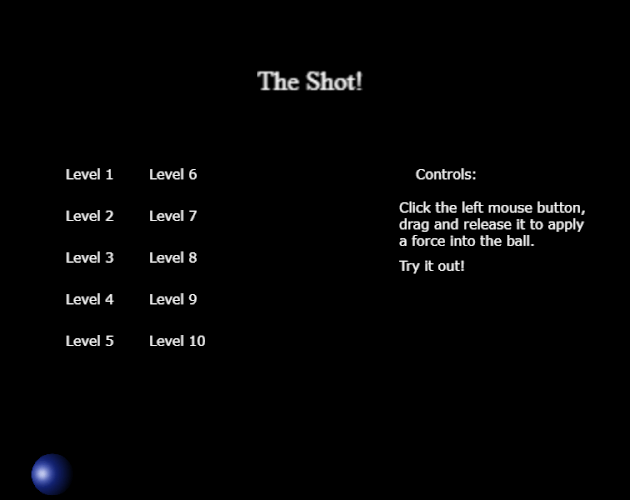

  

## Play

Game page on itch.io: https://guibdbello.itch.io/the-shot

  

### How to Play

- **Hold** the **left mouse button** to set the angle and force;
- **Release it** to "thrust" the player through the level.

## About

You have to complete each level in only **ONE SHOT!**

### Game Jam

This game was made for the game jam [**GMTK Game Jam 2019**](https://itch.io/jam/gmtk-2019) which took place between August 2nd and August 4th of 2019.

Theme: **only one**.

## Setup

### Installation

1. Clone repository: `git clone https://github.com/GuiBDBello/TheShot.git`.
2. Open the project in Visual Studio Code: `File > Open Folder...`.

### Development

1. Execute the command `npm run dev` to run locally.
2. Customize the code as you want in `src/` and `src/js/`.
3. Open http://localhost:8080 in your browser to playtest.

**Obs.:** Some links that may be helpful:

- https://photonstorm.github.io/phaser3-docs/
- https://phaser.io/learn

### Build

1. Execute the command `npm run build`. Inside the `dist` folder will be generated the file `main.js`, which you can host at your own website.
