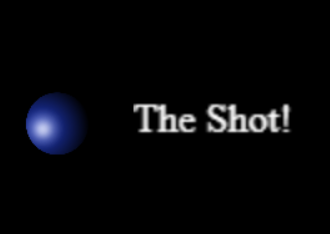

  

  You have to complete each level in only ONE SHOT!
   
   
  <a href="https://guibdbello.itch.io/the-shot">Play Demo</a>
  ·
  <a href="https://github.com/GuiBDBello/TheShot/issues/new?labels=bug&template=bug-report---.md">Report Bug</a>
  ·
  <a href="https://github.com/GuiBDBello/TheShot/issues/new?labels=enhancement&template=feature-request---.md">Request Feature</a>

## Table of Contents

<ol>
  <li><a href="#introduction">Introduction</a></li>
  <li><a href="#getting-started">Getting Started</a></li>
  <li><a href="#build-process">Build Process</a></li>
  <li><a href="#acknowledgments">Acknowledgments</a></li>
  <li><a href="#license">License</a></li>
</ol>

## Introduction

You have only one shot to reach the finish line. If anything reaches the finish line, you win!

  

### How to Play

- Hold the left mouse button to set the angle and force.
- Release it to apply the force to the ball.

### Game Jam

This game was made for the game jam [GMTK Game Jam 2019](https://itch.io/jam/gmtk-2019), which took place between August 2nd and August 4th of 2019.

Theme: **ONLY ONE**.

(<a href="#readme-top">back to top</a>)

## Getting Started

To get a local copy up and running follow the steps below.

### Prerequisites

1. Install [Node.js (v20.12.2) and npm (v10.5.2)](https://nodejs.org/en/download/package-manager/current).
1. Install [Visual Studio Code](https://code.visualstudio.com/download) or any other editor/IDE of your choice.

### Configuration

1. Clone repository: `git clone https://github.com/GuiBDBello/TheShot.git`.
1. Open the project in your IDE/text editor: `File > Open Folder...`.
1. Customize the code as you want in `src/` and `src/js/`.
1. Execute the command `npm install` to download the dependencies.
1. Execute the command `npm run dev` to run locally.
1. Open http://localhost:8080 in your browser to playtest.

(<a href="#readme-top">back to top</a>)

## Build Process

1. Execute the command `npm run build`. Inside the dist folder will be generated the file `main.js`, which you can host at your own website.

(<a href="#readme-top">back to top</a>)

## Acknowledgments

List of references that were useful in the making of this project:

* [Phaser](https://phaser.io/)
* [Phaser Learn](https://phaser.io/learn)

### Assets

| Name | Type | Creator | Source |
| --- | --- | --- | --- |
| Ball | Image | - | - |
| Board | Image | - | - |
| Box | Image | [Cpt_Flash](https://opengameart.org/users/cptflash) | [OpenGameArt](https://opengameart.org/content/2d-wooden-box) |
| Finish Flag | Image | [Cute Panda Co.](https://br.pinterest.com/cutepandaco/) | [Pinterest](https://br.pinterest.com/pin/175218241727373406/?amp_client_id=CLIENT_ID%28_%29&mweb_unauth_id=%7B%7Bdefault.session%7D%7D&amp_url=https%3A%2F%2Fbr.pinterest.com%2Famp%2Fpin%2F175218241727373406%2F&open_share=t) |
| Sky Background | Image | - | - |

(<a href="#readme-top">back to top</a>)

## License

Distributed under the MIT License. See [LICENSE](./LICENSE) for more information.

(<a href="#readme-top">back to top</a>)

